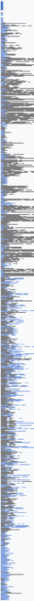

# ScrollPeek

**A scrollbar minimap for Firefox.**

Hover the scrollbar to see the whole page rendered as its own text. Move the
cursor over a section to read a preview of what's there. Click to jump.

A port of [Kate](https://kate-editor.org)'s scrollbar minimap to the browser.



## Why

Kate's scrollbar shows you the shape of a whole document without scrolling it,
and a preview when you hover. On a 5,000-line file that is the difference
between finding a function and hunting for it.

The web has no equivalent. On a long article or a documentation page you
scroll, stop, read, and scroll again — and usually overshoot. ScrollPeek keeps
the whole page beside you at all times and lets you aim before you leap.

## How it works

**This is a port, not an interpretation.** Where Kate's source settles a
question, the source wins. `textmap.js` follows `updatePixmap()` and
`miniMapPaintEvent()` step for step, including the arithmetic that is easy to
get subtly wrong:

| Kate | Ported as |
|---|---|
| `s_lineWidth` 100, `s_pixelMargin` 8, `s_linePixelIncLimit` 6 | same constants |
| `charIncrement = pixmapLineCount / grooveHeight`, capped at 6, then escalating to `lineIncrement` | `buildPixmap()` |
| `m_miniMapWidth(40)` | default strip width, 40px |
| `m_updateTimer.setInterval(300)` | `REBUILD_DELAY_MS` |
| `m_delayTextPreviewTimer.setInterval(250)`, first show only | preview debounce |
| `setScaleFactor(0.75)`, half width by fifth height, centred, clamped | `magnifier.js` |
| pixmap stretched to the strip; fade outside the viewport at alpha 110 | `paint()` |
| ~~`docHeight = min(groove, pixmapHeight*2) - 2`~~ | **not ported — see below** |
| `m_doc->lines() > 7500` skips highlighting | `SIMPLE_MODE_LINE_COUNT` |

Kate caches the pixmap and rebuilds it on a timer; scrolling only repaints.
That split is preserved, because building the map is the expensive half and
stretching it is not.

**The map is a raster of the page's text, not a schematic of its elements.**
Kate draws one pixel per character, coloured by that character's own
attributes, and downsamples by skipping every Nth line and every Nth character
as the document outgrows the strip. A page gives us the colouring for free —
Kate pays for syntax highlighting explicitly, whereas a page's computed styles
already separate headings, links, body copy, quotations and code.

`src/textmap.js` does this on a canvas.

One thing needed care: Kate asks its buffer for line *N* and gets line *N*, so
he knows exactly which characters are on which line. Here the text is laid out
by the browser, so that has to be recovered from the text node. A binary search
per line-box boundary, using `Range.getBoundingClientRect()` on single
characters, gets it exactly — O(log n) rect queries instead of O(n).
`test/verify_line_split.py` checks that against an oracle that measures every
character: 14 of 14 wrapped nodes exact, 2708 characters.

`test/fixtures/expected-map.png` is the real output, magnified 6×.

**The preview is not a zoom of the map.** Kate's `KateTextPreview` renders the
*real text* of the hovered region at 0.75 scale — smaller than the editor's own
text — in a frameless window half the view's width by a fifth of its height,
centred on the hovered line and debounced by 250ms so that sweeping the mouse
across the scrollbar does not strobe it. `src/magnifier.js` reproduces all of
that.

**We do not screenshot the page.** `tabs.captureVisibleTab` accepts a `rect`
in page coordinates, so off-screen capture is nominally possible — but
`content-visibility: auto` (Baseline 2024) tells the user agent to skip layout
and painting for off-screen content, and lazy images below the fold have not
loaded. An off-screen capture comes back blank. Reading the DOM instead is
immune to all of it, because the text is in the document whether or not it has
been painted. That is precisely why the one prior art on AMO, Scrollbar Lens,
shows an empty strip.

## Architecture

```
src/
  manifest.json      MV3
  background.js      settings and per-site enablement; owns no page data
  content.js         lifecycle: mount, and re-mount when settings change
  textmap.js         Kate's updatePixmap(), on a canvas
  rail.js            mounts the rail, installs our map
  magnifier.js       Kate's KateTextPreview(), on a canvas
  content.css        theming, via vugluscr's own custom properties
  vendor/            vugluscr 2.0.0, vendored (MIT)
```

`vugluscr` supplies the scrollbar mechanics — the thumb, click-to-jump,
drag-to-continue, wheel forwarding, the strip's hit area, and an SVG whose
`viewBox` is in document pixels, which is the coordinate space the preview
needs. Its own map is switched off rather than left running: `Minimap.renderSurface()`
returns early when `sourceElement` is null, after it has set the viewBox, so
nulling it costs us nothing we use and saves a per-element
`getBoundingClientRect` sweep of the whole document on every layout pass.

We never write rules against vugluscr's internals. Its colours are all
`--vugluscr_*` custom properties, and its structural CSS lives in
`@layer vugluscr.structure`, so an unlayered rule of ours restyles it without
fighting specificity. That is what keeps the vendored copy replaceable.

## Installing it to try

This is a Release build of Firefox, and Release will not install unsigned
extensions — `xpinstall.signatures.required=false` is silently ignored outside
Nightly, Developer Edition and ESR. What Release does accept is a **temporary
add-on**, which needs no Mozilla account and no signing.

The quick way:

```sh
python3 scripts/dev-launch.py                        # blank tab
python3 scripts/dev-launch.py https://en.wikipedia.org/wiki/Firefox
```

That starts a second Firefox on a throwaway profile in `test-profile/`, installs
ScrollPeek into it, and leaves the window open. Your existing Firefox, your
bookmarks and your other extensions are untouched — it really is a separate
instance. Close that window when you are done; if you restart Firefox you need
to run the script again, because temporary add-ons do not survive a restart.

The manual way, in your normal browser:

1. Open `about:debugging#/runtime/this-firefox`
2. **Load Temporary Add-on…**
3. Pick `src/manifest.json`

To install it permanently, submit to [addons.mozilla.org](https://addons.mozilla.org)
as an **unlisted** add-on. That is signed automatically and is not human
reviewed, which is the right route once the UI is settled.

## Settings

There are two places, and the split is not a preference — MDN decides it.

A **popup** is loaded fresh every time it opens and Firefox resizes it to fit
its content with *no vertical scrolling*, capped at 800×600. An unbounded list
does not fit in that. So the popup carries the settings you might want to reach
mid-browsing: the current site's toggle, the three-way scrollbar mode, the two
checkboxes and the width slider. The **options page** carries the site list,
which grows without bound.

MDN also settles three details that are easy to get wrong:

- **Width goes on `<body>`, not `:root`.** Firefox computes a popup's preferred
  width from the body, and ignores a width on the root.
- **`browser_style` must not be set.** Its support was removed in Manifest V3 in
  Firefox 118, so the popup is styled by hand.
- **Firefox defaults `default_area` to `"menupanel"`**, which is where the
  button lives until the user moves it. `"navbar"` would put it beside the URL
  bar, and Firefox remembers that choice per extension — so changing it later
  would need a new add-on id. Left at the default.

The toolbar button also shows state: the icon is dimmed and the tooltip says
"off" when ScrollPeek is disabled for the site you are on. Without it, the only
way to tell is to look for the rail, and "nothing appeared" is indistinguishable
from "broken".

Settings changes are broadcast from `browser.storage.onChanged` rather than by
each writer remembering to, so the popup, the options page and anything added
later all update the open tabs without knowing the tabs exist.

### Kate's own settings for this feature, and only those. From
`KateViewConfig` / the Appearance → Borders tab:

| Setting | Kate default | Here |
|---|---|---|
| Scrollbar minimap width | 60 | `minimapWidth` |
| Scrollbar preview (the hover preview) | on | `showMagnifier` |
| Scrollbar marks | off | `showMarkers` |
| Show scrollbars: always / when needed / never | always | `scrollbarMode` |

Two of my earlier guesses were wrong and are corrected: the default width is
**60**, not the 40 in `KateScrollBar`'s constructor — `kateview.cpp` applies the
config value at init and overrides it — and marks default **off**, which I had
on.

Deliberately **not** ported:

- **"Show whole document in the mini-map"** (`ShowScrollBarMiniMapAll`).
  Kate's own settings dialog hides its checkbox with the comment *"temporary
  until the feature is done"*, so it is not a setting anyone can depend on.
- **Preview size and scale.** Kate hardcodes half the window wide by a fifth
  tall, at 0.75 scale, and offers no control. Neither do we.
- **Map tint or opacity.** The map takes the page's own colours by design; a
  tint setting would fight that.

### Not in Kate

These are web-specific, with no analogue in an editor:

| Setting | Default | What it does |
|---|---|---|
| Minimap only, no track | off | Drops the narrow drag track, so the rail is just the map and takes 14px less. The page's gutter shrinks with it. |
| Hide until I scroll or approach | off | Parks the rail off the right edge. It returns on scroll, wheel, key press, or when the pointer comes within the trigger distance. |
| Trigger distance | 48px | How close to the right edge counts as "near". |
| Stay visible for | 1.6s | How long it stays after a trigger. |
| Strip colour | follows the page | The minimap's background. |
| Darken the page background by | 82% | How far to darken, for the default strip colour. |
| Minimum mark contrast | 3:1 | WCAG ratio the marks must reach against the strip. |

**On the strip colour and contrast.** Kate fills the minimap with the editor
background and draws the text's own colours into it, so his marks contrast by
construction. A page's text colours are chosen against the *page*, not against
our strip, so a dark grey that is perfectly legible in a light article vanishes
on a dark strip. The default is therefore a darker shade of the page's own
background — closer to Kate than a fixed grey, and still a background the marks
can be forced against.

The marks keep their hue and only their lightness moves, so a link stays
link-coloured. Measured on the fixture, the page's 1035 distinct mark colours
survive and the strip reaches 3.2:1 by default, 17:1 on a light override.

**On peek.** The rail is transformed off-screen rather than hidden, so it keeps
its box: the page's padding does not change when it slides away, and the
preview can still measure it while it is off-screen.

### Testing the settings

`test/test_settings.py` installs the extension with different defaults and
checks what a real page ends up with — that `never` releases the padding the
rail reserved, that `whenNeeded` hides on a page that fits, that the width
actually changes the rail, and that every control on the options page maps to a
real setting.

```sh
python3 test/test_ui.py               # the popup and the options page
python3 test/smoke.py                 # map, preview, click-to-jump, hover
python3 test/verify_alignment.py     # map, band, thumb and preview agree
python3 test/verify_hover_tracking.py # the preview follows a moving pointer
python3 test/verify_line_split.py     # line splitting is exact, vs an oracle
python3 test/test_settings.py         # every setting changes something
python3 test/probe_sites.py           # live sites; edit SITES at the top
```

Each test starts its own fixture server and its own headless Firefox on a
throwaway profile; nothing needs to be running first. All of them resolve the
extension through `test/harness.py`, so none of them can drift onto a stale
copy — one of them had a hardcoded scratch path and had been quietly testing
two-commit-old code.

`test/verify_hover_tracking.py` is a regression test for a bug that was only
visible by hand: the preview was debounced on every move, so it only updated
once the pointer stopped. It fires a burst of moves 16ms apart and checks each
one lands on its own document offset. Reverting the fix makes three of its
checks fail, so it is not a test that passes by accident.

Loads the extension into a throwaway Firefox profile as a temporary add-on and
drives it over a real page with Marionette, asserting that the rail mounts, that
the map painted the page's own colours, that the strip is still hit-testable,
that the preview appears at the right size and position, and that clicking
scrolls. Exits non-zero on failure.

## Status

Working end to end, and verified against live sites. The map, the preview,
click-to-jump and drag are in place; the smoke test covers them, and
`test/probe_sites.py` confirms the map renders on GitHub (9×, 20 colours),
Wikipedia (73×, 13,590 DOM nodes) and a 20,254-node W3C spec without breaking
the page layout.

Known gaps, in rough priority order:

- **A page is not linear text.** Kate lays out a buffer of lines; a page has
  grid and flex layouts where two elements share a row, and a line box can
  report a `y` far outside the document (Wikipedia's infobox reports
  y ≈ -100000 for content scrolled out of an inner container). Both are
  handled — out-of-document boxes are dropped, and the preview declutters each
  row left to right — but a page with heavy multi-column layout will preview
  less completely than a text file would.
- SPA route changes and lazily-mounted content are caught by a debounced
  `MutationObserver`, which fires constantly on sites like GitHub. It works,
  but the debounce is a guess.
- Only vertical page scroll. vugluscr can drive an inner scroller; we do not.
- Untested on Firefox for Android, and on sites that virtualise their content.

## Privacy

No network access, no analytics, no telemetry. ScrollPeek renders locally from
the page you are already looking at and stores nothing beyond your own
preferences.

It requests access to all URLs, because it has to read the structure and text of
any page you visit in order to draw the map. That permission is used for that
and nothing else.

## License

MIT
